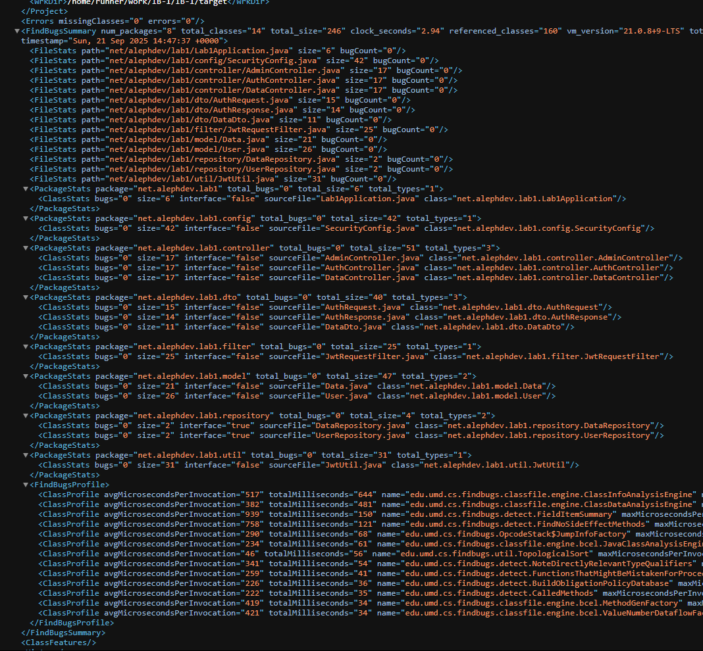
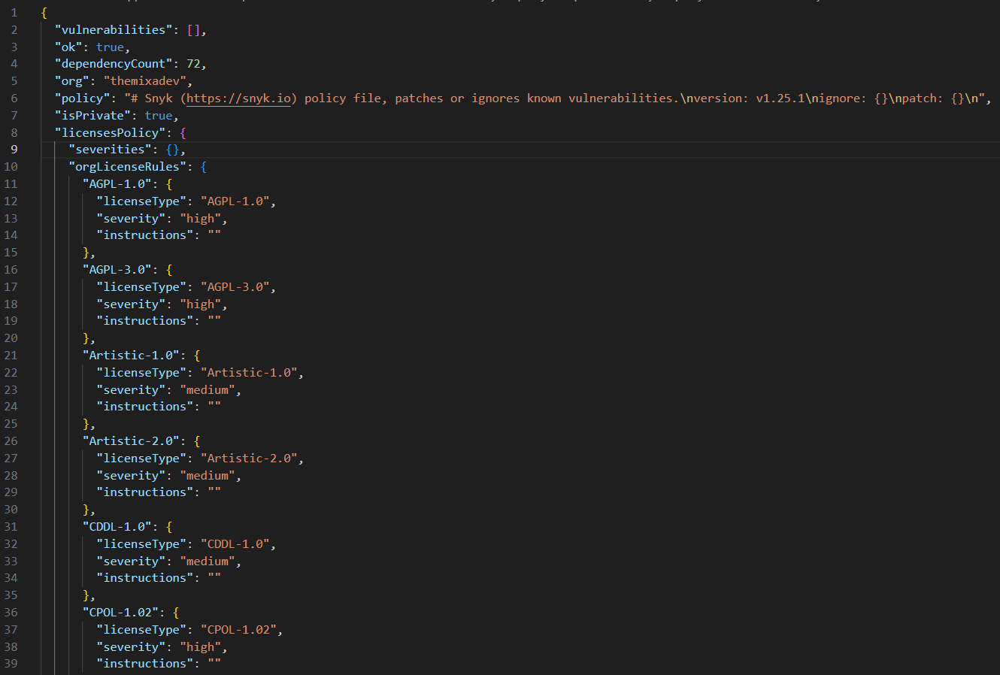

# Информационная Безопасность: работа 1.

Беляев Михаил Сергеевич P3412.

Сервис реализует базовые методы аутентификации с использованием JWT, шифрование паролей BCrypt и базовые меры защиты от XSS и SQL-инъекций.

Сервис использует:
- Java 21
- Spring Boot 3.5.6
- Spring Data JPA
- PostgreSQL
- jsonwebtoken 0.11.5

## Эндпоинты API

### Аутентификация

*   **`POST /auth/login`**: Аутентифицирует пользователя и возвращает JWT.
    *   **Тело запроса**:
        ```json
        {
            "username": "user",
            "password": "password"
        }
        ```
    *   **Успешный ответ**:
        ```json
        {
            "token": "your.jwt.token"
        }
        ```

### Доступ к данным

*   **`GET /api/data`**: Возвращает список всех объектов, созданных пользователями (не администраторами).
    *   **Заголовки**: `Authorization: Bearer your.jwt.token`
    *   **Успешный ответ**:
        ```json
        [
            {"content": "DATA"}
        ]
        ```

*   **`POST /api/data`**: Создает новый объект данных от имени пользователя.
    *   **Заголовки**: `Authorization: Bearer your.jwt.token`
    *   **Тело запроса**:
        ```json
        {
            "content": "<script>alert('XSS')</script>"
        }
        ```
    *   **Успешный ответ**:
        ```json
        {
            "content": "&lt;script&gt;alert('XSS')&lt;/script&gt;"
        }
        ```

*   **`GET /api/admin/data`**: Возвращает **все** объекты данных (пользовательские и админские).
    *   **Заголовки**: `Authorization: Bearer your.jwt.token` (должен быть токен администратора)
    *   **Успешный ответ**:
        ```json
        [
            {"content": "DATA"},
            {"content": "ADMIN"}
        ]
        ```

*   **`POST /api/admin/data`**: Создает новый объект данных от имени администратора.
    *   **Заголовки**: `Authorization: Bearer your.jwt.token` (должен быть токен администратора)
    *   **Тело запроса**:
        ```json
        {
            "content": "ADMIN"
        }
        ```
    *   **Успешный ответ**:
        ```json
        {
            "content": "ADMIN"
        }
        ```
*   В случае отправки некорректных данных или использования методов не с корректным токеном возвращается код ответа 403.
## Реализованные меры безопасности

### Реализация аутентификации
API использует JSON Web Tokens (JWT) для stateless-аутентификации. JWT выдается после успешного входа в систему и должен быть включен в заголовок `Authorization` для всех защищенных эндпоинтов.

Пароли не хранятся в открытом виде. Они хешируются с использованием алгоритма `BCrypt`.

`SecurityConfig` реализует контроль уровня доступа, открывая для всех только `/auth/login`, а пользователям с ролью "ADMIN" дополнительно открывается `/api/admin/**`.

`JwtRequestFilter` реализует извлечение и валидацию токенов пользователей, с установкой `SecurityContext` в случае использования валидного токена.

### Защита от SQL-инъекций (SQLi)
Приложение использует Spring Data JPA и Hibernate в качестве ORM для взаимодействия с базой данных PostgreSQL. Все запросы к базе данных обрабатываются через `JpaRepository`, который по умолчанию использует параметризованные запросы (Prepared Statements), что предотвращает манипулирование SQL-запросами путем внедрения вредоносного SQL-кода.

### Защита от XSS
Используется санитизация ввода. Все данные, возвращаемые пользователям, проходят санитизацию для экранирования HTML-символов, что предотвращает XSS-атаки. Для этого используется метод `HtmlUtils.htmlEscape()`, который заменяет небезопасные символы в их HTML представления.

## Отчеты SAST/SCA

В качестве SAST используется SpotBugs, анализирующий байт-код Java на предмет потенциальных уязвимостей и дефектов кода.

В качестве SCA используется Snyk, сканирующий зависимости на наличие CVE и предлагает пути решения.

[Последний PipeLine](https://github.com/TheMixaDev/IB-1/actions/runs/17895098021) (Без учета обновления README)

SpotBugs не нашел каких-либо ошибок: [(Отчет)](./docs/spotbugsXml.xml)



Snyk не нашел известных уязвимостей в используемых библиотеках: [(Отчет)](./docs/snyk-report.json)

